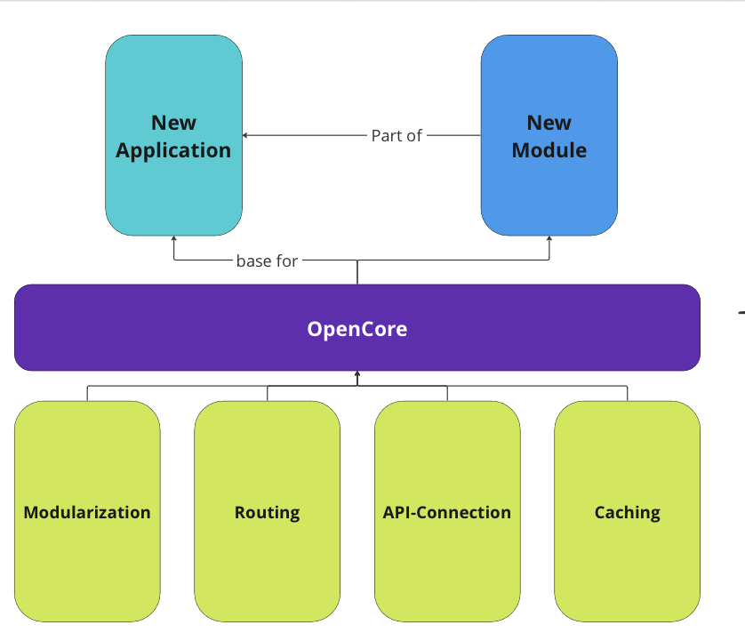

# FieldMApp OpenCore

OpenCore package can be the base of an application or package, offering a streamlined integration of Module Interfaces and a powerful dependency injection system (created with [get_it](https://pub.dev/packages/get_it)). It simplifies module management and enhances interoperability. Additionally, it includes an efficient Data-layer Logic for connecting and caching multiple data sources, optimizing data access and application performance. Designed for ease of use and scalability, a tool for developers looking to enhance their application's architecture and data handling capabilities.

**Citation**

**Open Core Building Blocks**

## Code Generation

- generate code with `flutter packages pub run build_runner build --delete-conflicting-outputs`
- this is needed to create the Hive-Adapters for the cachinglayer, currently used by `api/data`, `api/media` and `api/auth`

## Architecture

### Data layer

The DataLayer implementation addresses the issue of offering a generic interface for **API connections** and provides a **caching interface** to support an offline-first approach.

Data layer implementation according to this [App-Architecture](https://codewithandrea.com/articles/flutter-app-architecture-riverpod-introduction/) which is a customized extension off [clean architecture by uncle bob](https://blog.cleancoder.com/uncle-bob/2012/08/13/the-clean-architecture.html), inspired by the [Riverpod-Architecture](https://codewithandrea.com/articles/flutter-project-structure/) by Andre Bizzotto.

**Overview**
- `api/auth`
    - Interface and mixin implementation for the universial auth-flow of the application. 
    - optional auth-credentials are cached using AES-encrypted device storage
- `api/data`
    -  Interface and mixin implementation for the universial DTO-object handling. 
    - handels caching of DTO-object, stored on device using AES-Encryption
- `api/media`
    -  Interface and mixin implementation for the universial File/Media-Upload handling. 
    - handels caching, data stored on device using AES-Encryption
- `api/provider`
    - provider/data source specific implementations of `auth`, `media` and `data` Interfaces
    - currently only Appwrite-Provider implemented
    - mixed provider implementations are possible (i.e. for CQRS)
    - provider implementation can also be done outside of this package

#### Caching

**cache-Aside** 

- *todo*

https://codeahoy.com/2017/08/11/caching-strategies-and-how-to-choose-the-right-one/

#### Modularization

- *todo*

#### Routing

- *todo*

## Examples

You can find in depth examples in `/examples`.

*Creating a Module*

- *todo*

*Creating Module routes*

- *todo*

*Creating a Repository/Api-Connection*

- *todo*

*Using the Cache*

- *todo*

